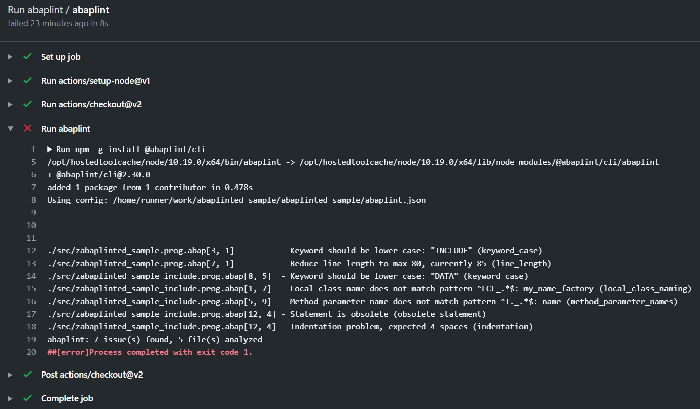

# Using abaplint in CI

There are several ways to enable automated linting of your code in popular cloud git repositories. This will allow auto-linting of commits to master branch and auto checks for upcoming pull requests from colleagues or contributors.

- Gitlab: example can be found in [examples/.gitlab-ci.yml](examples/.gitlab-ci.yml). Working repo for this configuration can be found at [abaplinted_sample gitLAB](https://gitlab.com/atsybulsky/abaplinted_sample)
- Travis: example configuration is in [examples/.travis.yml](examples/.travis.yml). Repository example is at [abaplinted_sample gitHUB](https://github.com/sbcgua/abaplinted_sample) (also check pull requests)
- Github actions: example workflow can be seen in [github-actions-workflow.yml](github-actions-workflow.yml). See working repo example at [abaplinted_sample gitHUB](https://github.com/sbcgua/abaplinted_sample)

